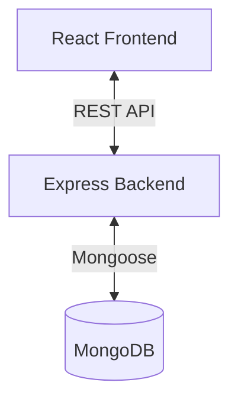

# Ride Booking Application

## 📌 Project Overview
This is a full-stack ride-booking web application designed to simulate core functionalities of services like Ola or Uber. The application features a comprehensive booking flow, real-time-like status updates, driver and user dashboards, and a robust authentication system. It is built with a focus on modular architecture, clean code practices, and production-readiness.

## 🛠 Tech Stack

| Component | Technology | Description |
|-----------|------------|-------------|
| **Frontend** | React (Vite) | Fast, modern UI library with TypeScript for type safety. |
| **State Management** | Redux Toolkit | Efficient global state management for user sessions and booking flows. |
| **Backend** | Node.js + Express | Scalable REST API architecture. |
| **Database** | MongoDB | NoSQL database for flexible data modeling (Users, Drivers, Bookings). |
| **Styling** | CSS Modules / Vanilla | Custom styling for a premium, responsive user interface. |
| **Authentication** | JWT (JSON Web Tokens) | Secure stateless authentication for protected routes. |

## 🏗 High-Level Architecture


## 🚀 Prerequisites
Ensure you have the following installed on your local machine:
- **Node.js** (v16 or higher)
- **npm** (v8 or higher)
- **MongoDB** (Local instance running on port `27017`)

## ⚙️ Setup & Installation

### 1. Database Setup
Ensure your local MongoDB instance is running.
```bash
# Verify MongoDB is running
mongosh
```
*Note: This project uses a local MongoDB instance. No cloud Atlas setup is required.*

### 2. Backend Setup
Navigate to the backend directory and install dependencies.
```bash
cd backend
npm install
```
Create a `.env` file in the `backend` directory (see `.env.example` if available, otherwise use defaults):
```env
PORT=5000
MONGO_URI=mongodb://127.0.0.1:27017/rideApp
JWT_SECRET=your_jwt_secret_key
```
Start the backend server:
```bash
npm run dev
```
*Server runs on: `http://localhost:5000`*

### 3. Frontend Setup
Navigate to the frontend directory and install dependencies.
```bash
cd ola-frontend
npm install
```
Start the frontend development server:
```bash
npm run dev
```
*Frontend runs on: `http://localhost:5173`*

## 📝 Evaluation Notes for Recruiters
- **Architecture**: The project follows a clear separation of concerns. The backend uses a controller-service-repository pattern (implied) to keep logic clean.
- **Type Safety**: TypeScript is used extensively in the frontend to prevent runtime errors and improve developer experience.
- **Scalability**: The folder structure is designed to scale. New features can be added as new modules without cluttering existing code.
- **UX/UI**: The interface is designed to be intuitive and responsive, mimicking real-world ride-booking apps.

---
*Developed by Shantvanu Mutha*
